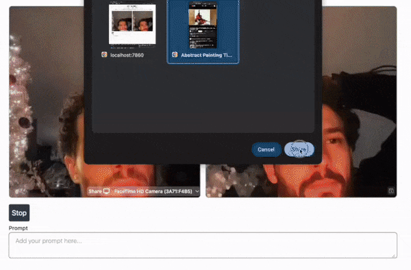

# Img2Img Example

[English](./README.md) | [日本語](./README-ja.md)

<p align="center">
  
</p>

<p align="center">
  
</p>


This example, based on this [MPJEG server](https://github.com/radames/Real-Time-Latent-Consistency-Model/), runs image-to-image with a live webcam feed or screen capture on a web browser.

## Usage
You need Node.js 18+ and Python 3.10 to run this example.
Please make sure you've installed all dependencies according to the [installation instructions](../../README.md#installation).

```bash
cd frontend
npm i
npm run build
cd ..
pip install -r requirements.txt
python main.py  --acceleration tensorrt   
```

or 

```
chmod +x start.sh
./start.sh
```

then open `http://0.0.0.0:7860` in your browser.
(*If `http://0.0.0:7860` does not work well, try `http://localhost:7860`)

### Running with Docker

```bash
docker build -t img2img .
docker run -ti -e ENGINE_DIR=/data -e HF_HOME=/data -v ~/.cache/huggingface:/data  -p 7860:7860 --gpus all img2img
```

Where `ENGINE_DIR` and `HF_HOME` set a local cache directory, making it faster to restart the docker container.

## Photo Sharing Options

The application now supports two simple sharing methods:

### 1. DigitalOcean Spaces (Recommended)
- **Permanent cloud storage** with CDN support
- Photos include the decorative frame
- See [CONFIGURACION_DIGITALOCEAN.md](./CONFIGURACION_DIGITALOCEAN.md) for setup
- Requires DigitalOcean account ($5/month)
- Full control over your files

### 2. Local Storage
- Photos saved on the server
- Accessible via local network
- No external accounts needed
- Photos include the decorative frame

### Configuration

Edit `frontend/src/lib/config.ts` to choose your preference:

```javascript
export const ShareConfig = {
  mode: 'digitalocean',  // or 'local'
};
```

### Key Features
- **Photos now include the decorative frame** in both modes
- Simplified configuration - just two clear options
- No complex setup for multiple temporary services